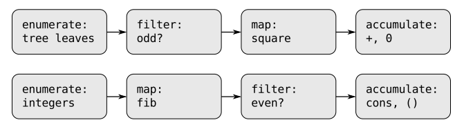

## 内容

- 2.2.3 序列作为一种约定的界面
- 做第二章的习题2.17---习题2.29

## 笔记

- 这里介绍一种与数据结构有关的设计方式－－使用约定的界面。为了说明问题，这里举个两个例子：
```
(define (sum-odd-squares tree)
  (cond
    ((null? tree) nil)
    ((not (pair? tree))
      (if (odd? tree)
        (square tree)
        0))
    (else
      (+ (sum-odd-squares (car tree))
         (sum-odd-squares (cdr tree))))))
(define (even-fibs n)
  (define (next k)
    (if (> k n)
      nil
      (let ((f (fib k)))
        (if (even? f)
          (cons f (next (+ k 1)))
          (next (+ k 1)))))))
```
这两个程序有一些共性，如下图所示：



但是这上面的两个过程定义并没有区分这种信号流结构。比如：

> 在`sum-odd-squares`过程中，枚举的工作部分由检查`null?`和`pair?`实现，部分的由过程的树形递归实现。
>
> 与此类似，在那些检查中也可以看到一部分累积工作，另一部分是用在递归中的加法。

上面的两个例子，把与其相关的映射、过滤器和累积器混在一起，使得过程看起来不那么明显，本小节讲的就是如何通过重新组织程序，使信号流结构明显表现在写出的过程中，这样程序的可读性就会大大增加。

- 映射对应2.2.1小节的map过程
- 过滤
```
(define nil '())
(define (filter predicate sequence)
  (cond 
    ((null? sequence) nil)
    ((predicate (car sequence))
      (cons (car sequence)
            (filter predicate (cdr sequence))))
    (else (filter predicate (cdr sequence)))))
(filter odd? (list 1 2 3 4))
;Value: (1 3)
```
- 累积
```
(define (accumulate op initial sequence)
  (if (null? sequence)
    initial
    (op (car sequence)
        (accumulate op initial (cdr sequence)))))
(accumulate + 0 (list 1 2 3 4))
;Value: 10
```

有了上面三个表操作，下面就剩下实现有关的信号流图，枚举出需要处理的数据序列。对应`even-fibs`，我们需要生成出一个给定区间里的整数序列：
```
(define (enumerate-interval low high)
  (if (> low high)
    nil
    (cons low (enumerate-interval (+ low 1) high))))
```
要枚举出一个树的叶子节点，可以用：
```
(define (enumerate-tree tree)
  (cond
    ((null? tree) nil)
    ((not (pair? tree))
        (list tree))
    (else (append (enumerate-tree (car tree))
                  (enumerate-tree (cdr tree))))))
(enumerate-tree (list 1 (list 2 (list 3 4) 5)))
;Value: (1 2 3 4 5)
```

好了， 有了上面这些过程，我们就可以像信号流图那样重现构造`sum-odd-squares`和`even-fibs`了。
```
(define (sum-odd-squares tree)
  (accumulate +
              0
              (map square (filter odd?
                                  (enumerate-tree tree)))))
(define (even-fibs n)
  (accumulate cons
              nil
              (filter even?
                      (map fib
                           (enumerate-interval 0 n)))))
```
这样，将程序表示为一些针对序列的操作，就能够帮助我们得到上面模块化的程序设计了。