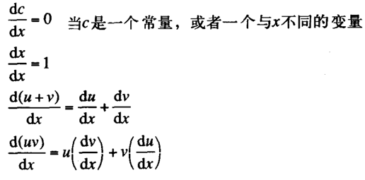

## 内容

- 2.3小节的符号数据以及2.3.2的实例：符号求导

## 笔记

首先明确基本的求导规则（针对加法与乘法）：



可以看到最后两条规则具有递归的性质。

根据数据抽象的原则，我们可以先假设拥有下面一系列过程：
```
(variable? e)           ;e是变量吗？
(same-variable? v1 v2)  ;v1、v2是同一变量吗？
(sum? e)                ;e是和式吗？
(addend e)              ;e的被加数
(augend e)              ;e的加数
(make-sum a1 a2)        ;构造a1与a2的加数
(product? e)            ;e是乘式吗？
(multiplier e)          ;e的被乘数
(multiplicant e)        ;e的乘数
(make-product e1 e2)    ;构造m1与m2的乘式
```
利用上面这些过程，再加上一个判断表达式是否为数值的基本过程`number?`，就可以写出下面的求导过程了：
```
(define (deriv exp var)
  (cond
    ((number? exp) 0)
    ((variable? exp)
      (if (same-variable? exp var) 1 0))
    ((sum? exp)
      (make-sum (deriv (addend exp) var)
                (deriv (augend exp) var)))
    ((product? exp)
      (make-sum
        (make-product (multiplier exp)
                      (deriv (multiplicand exp) var))
        (make-product (multiplicand exp)
                      (deriv (multiplier exp) var))))
    (else
      (error "Unknown expression type: DERIV" exp))))
```
这里的`deriv`过程基于抽象的数据构造起来，因此，无论我们如何选择代数表达式的具体表示，只要相应的构造函数与选择函数确定好了，这个过程就可以工作了。
