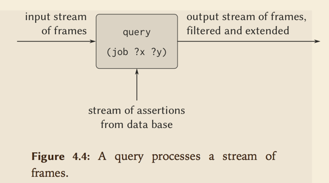
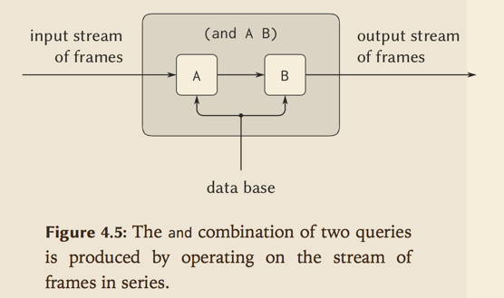
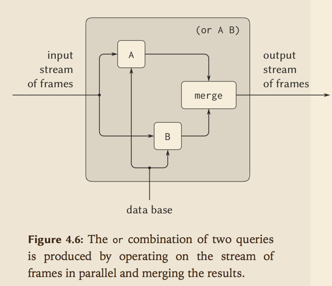

## 查询系统

查询系统主要包括两个核心操作：

- pattern matching 模式匹配，用于实现简单查询与复杂查询
- unification  合一，用于实现规则

## 模式匹配

模式匹配的输入如下:

- a pattern 一个模式
- a datum   一个数据集
- a frame that specifies bindings for various pattern variables 指明模式变量绑定的框架

Pattern matcher checks whether the datum matches the pattern in a way that is consistent with the bindings already in the frame. If so, it returns the given frame augmented by any bindings that may have been determined by the match. Otherwise, it indicates that the match has failed.


模式匹配检查给定的数据集在给定框架内模式变量不冲突的前提下，是否满足给定模式。如果满足，就返回由模式变量绑定扩充后的的框架，如果不满足，它声明这次匹配失败了。


The pattern matcher is all the mechanism that is needed to process simple queries that don’t involve rules. For instance, to process the query

仅仅利用模式匹配我们就能够处理不涉及规则的简单查询。例如：
```
(job ?x (computer programmer))
```
我们首先扫描数据库中所有的断言（assertions），然后按照输入框架绑定为空的情况下，去找出与模式相匹配的断言，对于匹配的断言，如果匹配成功，就用这次匹配所返回的框架来实例化`?x`的值。


### Streams of frames 框架的流

The testing of patterns against frames is organized through the use of streams.




## Compound queries 复合查询

```
(and (can-do-job ?x (computer programmer trainee))
     (job ?person ?x))
```

we first find all entries that match the pattern

```
(can-do-job ?x (computer programmer trainee))
```

This produces a stream of frames, each of which contains a binding for ?x. Then for each frame in the stream we find all entries that match

```
(job ?person ?x)
```

in a way that is consistent with the given binding for ?x. Each such match will produce a frame containing bindings for ?x and ?person. The `and` of two queries can be viewed as a series combination of the two component queries





## Unification 合一

In order to handle rules in the query language, we must be able to find the rules whose conclusions match a given query pattern.

为了能够在查询语言中处理规则，我们必须能够找出其结论符合给定查询模式的规则。

“Rule conclusions are like assertions except that they can contain variables, so we will need a generalization of pattern matching called unification—in which both the “pattern” and the “datum” may contain variables.

规则的结论和断言很像，只是规则中可以包含变量，所以我们需要用归一化的模式匹配——合一（这其中模式与数据集都可以包含变量）。

合一器有两个输入模式，每一个都包含有常量与变量，然后判断是否可能赋值给变量，让这两个模式相等。如果能够找到，它就返回包含着有关约束的框架。

合一算法是查询系统中最难的部分。对于复杂的模式，执行合一需要做推理。


### Applying rules

In general, the query evaluator uses the following method to apply a rule when trying to establish a query pattern in a frame that specifies bindings for some of the pattern variables:

- Unify the query with the conclusion of the rule to form, if successful, an extension of the original frame.
- Relative to the extended frame, evaluate the query formed by the body of the rule.


### Simple queries

Given the query pattern and a stream of frames, we produce, for each frame in the input stream, two streams:

- a stream of extended frames obtained by matching the pattern against all assertions in the data base (using the pattern matcher), and
- a stream of extended frames obtained by applying all possible rules (using the unifier)

Appending these two streams produces a stream that consists of all the ways that the given pattern can be satisfied consistent with the original frame.
