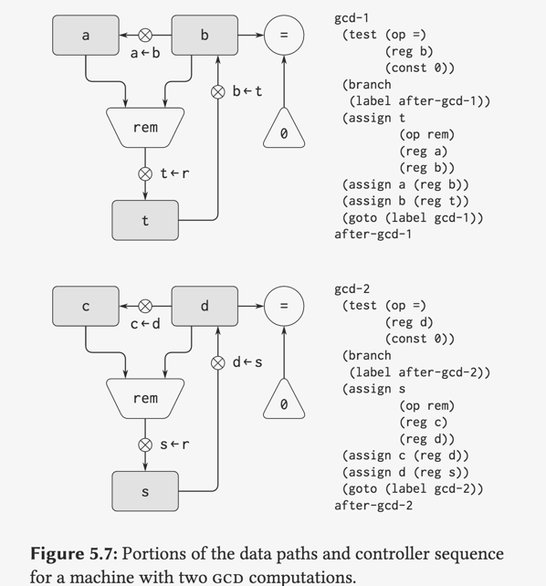

## 子程序



```
gcd
  (test (op =) (reg b) (cons 0))
  (branch (label gcd-done))
  (assign t (op rem) (reg a) (reg b))
  (assign a (reg b))
  (assign b (reg t))
  (goto (label gcd))
gcd-done
  (goto (reg continue))
  ...

;; Before calling gcd, we assign to continue
;; the label to which gcd should return.
  (assgin continue (label after-gcd-1))
  (goto (label gcd))
after-gcd-1
  ....

 ;;  Here is the second call to gcd, with a different contiuation
   (assign contiue (label after-gcd-2))
   (goto (label gcd))
after-gcd-2   

```
