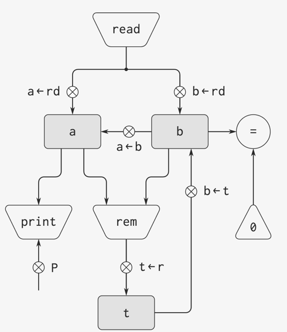

- 一部GCD机器的规范描述

```
(data-paths
  (registers
    ((name a)
      (buttons ((name a<-b) (source (register b)))))
    ((name b)
      (buttons ((name b<-t) (source (register t)))))
    ((name t)
      (buttons ((name t<-r) (source (operation rem))))))

  (operations
    ((name rem)
      (inputs (register a) (register b)))
    ((name =)
      (inputs (register b) (constant 0)))))

(controller
  test-b
    (test =)
    (branch (label gcd-done))
    (t<-r)
    (a<-b)
    (b<-t)
    (goto (label test-b))
  gcd-done)
```

- 精简版

```
(controller
  test-b
    (test (op =) (reg a) (const 0))
    (branch (label gcd-done))
    (assign t (op rem) (reg a) (reg b))
    (assign a (reg b))
    (assign b (reg t))
    (goto (label test-b))
  gcd-done)
```

## 动作（Action）

- 一部读输入并打印结果的GCD机器
```
(controller
  gcd-loop
    (assign a (op read))
    (assign b (op read))
  test-b
    (test (op =) (reg b) (const 0))
    (branch (label gcd-loop))
    (assign t (op rem) (reg a) (reg b))
    (assign a (reg b))
    (assign b (reg t))
    (goto (label test-b))
  gcd-done
    (perform (op print) (reg a))
    (goto (label gcd-loop)))
```


