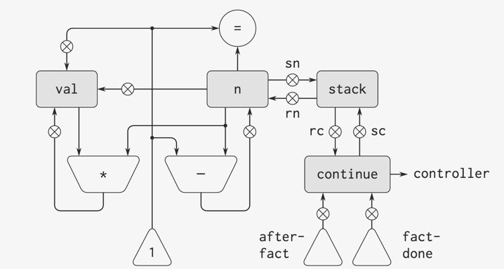

```
(define (factorial n)
  (if (= n 1)
    1
    (* n (factorial (- n 1)))))

(define (gcd a b)
  (if (= b 0)
    a
    (gcd b (remainder a b))))    
```
- 这里的`factorial`过程与之前的`gcd`有一点重要的不同，`gcd`过程将原来的计算简化为一个新的GCD计算，而`factorial`则要求计算出另一个阶乘作为子问题。在`gcd`过程里，对于新的GCD计算的回答也就是原来问题的回答。为了计算下一个GCD，我们只需简单地将新的参数放进GCD机器的输入寄存器里，并通过执行同一个控制器序列，重新使用这个机器的数据通路。在机器完成了最后一个GCD问题的求解时，整个计算也就完成了。
- 但是，在阶乘（以及其他任何递归的计算过程）的情况里，对于新的阶乘子问题的回答并不是对于愿问题的回答。
- 每部阶乘机器里都需要包含另一部阶乘机器，完整的机器中要包含无穷嵌套的类似机器，这是不可能从固定的有限个部件构造起来的。
- 然而，我们还是有可能将这一阶乘计算过程实现为一部寄存器机器，只要我们能够做出一种安排，设法使每个嵌套的机器实例都使用同样的一组部件。也就是说，计算`n!`的机器应该用同样部件去完成计算针对`(n-1)!`的子问题，并如此下去。这是可能的，因为虽然阶乘计算过程在执行中要求同一机器的无穷多个副本，但是在任何给定时刻，它所实际使用的知识这些副本中的一个。



```
(controller
  (assign continue (label fact-done))
fact-loop
  (test (op =) (reg n) (const 1))
  (branch (label base-case))
  ;; Set up for the recursive call by saving n and continue.
  ;; Set up continue so that the computation will continue at after-fact when the subroutine returns
  (save continue)
  (save n)
  (assign n (op -) (reg n) (const 1))
  (assign continue (label after-fact))
  (goto (label fact-loop))
after-fact
  (restore n)
  (restore continue)
  (assign val (op *) (reg n) (reg val))  ; val now contains n(n-1)!
  (goto (reg continue))                  ; return to caller
base-case
  (assign val (const 1))                 ; base case: 1! = 1
  (goto (reg continue))                  ; return to caller
fact-done)
```

- 阶乘的这一具体实现展示了实现递归算法的通用策略：

    > 采用一部常规的寄存器机器，再增加一个堆栈。在遇到递归子程序时，只要某些寄存器的值在子问题求解完成后还需要用，就把它们的当前值存入堆栈。而后去求解递归的子问题，再恢复保存起来的寄存器值，并继续执行原来的主程序。
