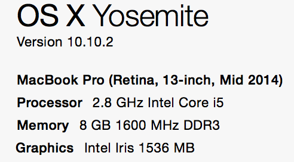

[SICP](http://book.douban.com/subject/1451622/)，一本讲解编程真谛的经典教材。之前上大学期间，陆陆续续看了2遍这本书，无奈都没坚持到底。第一次只看完第一章，第二次只看完前三章。很多习题也没做。

这，是第三次进攻。这个 repo 会记录我在看 SICP 时的习题代码与一些自己的笔记与想法，这么做一方面是给自己查漏补缺，另一方面也为希望对今后阅读 SICP 的人有些许帮助。

为了方便检索，我使用 `gitbook` 制作了[《SICP 读书笔记》电子书](http://sicp.liujiacai.net/)，供大家参考。

## Why SICP

- [老赵书托（2）：计算机程序的构造与解释](http://blog.zhaojie.me/2009/07/recommended-reading-2-sicp.html)  
- [向热爱计算机科学的你推荐SICP](http://www.nowamagic.net/librarys/veda/detail/1905)
- [如何掌握程序语言](http://yinwang0.lofter.com/post/183ec2_47bea8) by 王垠
- [Its the Best! Its the Worst! Why the split?](http://www.amazon.com/review/R403HR4VL71K8/ref=cm_cr_dp_title?ie=UTF8&ASIN=0262011530&channel=detail-glance&nodeID=283155&store=books) by Google公司研究总监[彼得·诺维格](https://en.wikipedia.org/wiki/Peter_Norvig)
- [The Structure and Interpretation of the Computer Science Curriculum](http://www.ccs.neu.edu/racket/pubs/jfp2004-fffk.pdf) PDF文档。完美的东西并不存在，[HTDP](http://www.htdp.org/) 的作者们在这篇文章里面指出了 SICP 弊端

## 目标

<del> 在**2016年1月1号**之前啃完**所有章节与习题**！！</del> 失败告终。只完成前三章。

新的一年继续[读书计划](http://book.douban.com/people/liujiacai/do)，2016年6月30号前，完成剩下的第四章、第五章。

## 建议

完完整整看完一本书是一件困难的事，本书更是如此。

这本书的很多内容、习题需要仔细揣摩才能领略其精髓，所以看这本书一定不要**心急**。
其次，在阅读时，请务必关闭手机上一些社交工具，并预留出至少 1 个小时的完整时间来看，否则我不认为你真的能有所收获。

学习是件很苦的事，大多数人都是三分钟热度，所以如果你觉得看这本书让你很烦躁，不妨出去运动一下，或听一会[音乐🎵](http://music.163.com/#/artist?id=88149)，第二天接着来。坚持下来，不要放弃，更不要失去对探索编程真谛的好奇心。

以上与所有 SICPer 共勉。

## 环境准备

工欲善其事必先利其器。下面说下我Mac上的scheme环境：

- 
- [mit-scheme 9.2](http://ftp.gnu.org/gnu/mit-scheme/stable.pkg/9.2/mit-scheme-9.2-x86-64.dmg)，我的Mac版本是10.10.2，按照上这个官方scheme后点击图标，闪退，不清楚为什么，我这里直接把`MIT:GNU Scheme.app/Contents`下的`Resources`文件夹拷贝出来，并把它加入的PATH中，这样就能够运行了。

- 这里安装好的scheme在交互式环境下[无法使用方向键](http://stackoverflow.com/questions/27648559/mit-scheme-cant-move-left-when-enter-code)，可以通过安装rlwrap解决（`brew install rlwrap`）之后，用`rlwrap mit-scheme`启动就可以了。
- 英文版epub＋中文版实体书，计算机的书最好还是看英文原版，我这里买了中文版的实体书，英文版的好贵！<del>不过[多看](http://duokan.com/)对epub格式支持很好，放手机上看很方便，而且多看支持划词翻译，写笔记，笔记同步Evernote等等，真是太方便了，推荐大家使用。</del>手机屏幕还是太小了，而且很容易分心，[Kindle Paperwhite](http://www.amazon.cn/gp/product/B00QJDOLIO)才是真爱，值得拥有💖。
- mit-scheme直接从文件中读取代码并执行，例如有个文件名为`fib.scm`的文件，在scheme交互式环境下通过`(load "fib.scm")`命令就能够执行`fib.scm`中的代码了。
- 2.2.4小节用到的图形语言采用Racket实现，这是它的[文档](http://planet.racket-lang.org/package-source/soegaard/sicp.plt/2/1/planet-docs/sicp-manual/index.html)。
- 2.4.3小节`put`与`get`的实现，参考[/exercises/02/lib/hash_table.scm](/exercises/02/lib/hash_table.scm)

我的初始化环境就是这样了，后面如果有改变我会修改这里的说明。

## 辅助资料

- [Google](https://www.google.com/ncr) is always your friend
- [MIT SICP Web Site](http://mitpress.mit.edu/sicp)
- [MIT 视频公开课](http://ocw.mit.edu/courses/electrical-engineering-and-computer-science/6-001-structure-and-interpretation-of-computer-programs-spring-2005/video-lectures/)，百度网盘[下载地址](http://pan.baidu.com/s/1jGrI5EY)
- [epub 格式 + 在线 HTML5 版的 SICP](https://github.com/sarabander/sicp)
- [北大 SICP 教学主页](http://www.math.pku.edu.cn/teachers/qiuzy/progtech/)，强烈推荐，课堂PPT总结的很好，还有中文版的[勘误表](http://www.math.pku.edu.cn/teachers/qiuzy/books/sicp/errata.htm)
- [SICP in Javascript](https://www.comp.nus.edu.sg/~cs1101s/sicp/)，新加坡国立大学计算机学院 cs1101 课程

## QQ 群

欢迎在读或打算读 SICP 的朋友加入 SICP 读书 QQ 群：`119845407`，让我们一起探索编程的奥妙。

手机 QQ 可直接扫码加入。

## Timeline

- 2015-5-17  第三次开启SICP之旅
- 2015-7-12  结束第一章，构造过程抽象。[我的总结](http://liujiacai.net/blog/2015/07/18/sicp-chapter1-summary/)
- 2015-9-20  结束第二章，构造数据抽象。[我的总结](http://liujiacai.net/blog/2015/09/20/sicp-chapter2-summary/)
- 2015-12-26  结束第三章，模块化、对象和状态。[我的总结](http://liujiacai.net/blog/2015/12/26/sicp-chapter3-summary/)
- 2016-04-23  结束第四章，元语言抽象。[我的总结](http://liujiacai.net/blog/2016/04/23/sicp-chapter4-summary/)

## License

- 代码使用 [MIT License](http://liujiacai.net/license/MIT.html?year=2015)
- 笔记使用 [知识共享署名-相同方式共享 4.0 国际许可协议](http://creativecommons.org/licenses/by-sa/4.0/)
