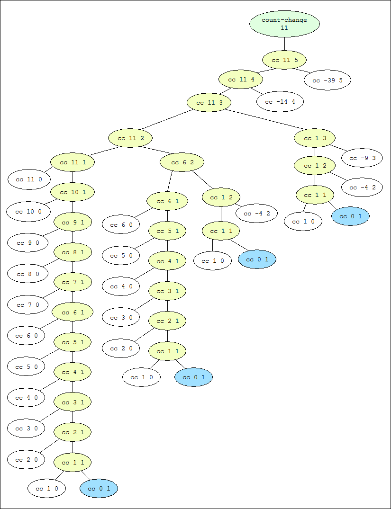
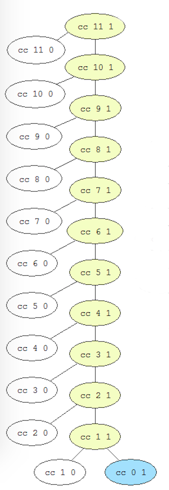
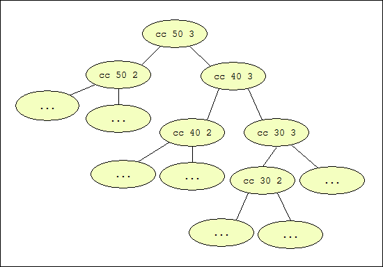

找零钱的代码可以在[这里](/05/2015-05-21-count-change-recurisve.md)找到。
首先是画出11美分的计算过程：



我这里偷了个懒，在网上找了个图片，不过我自己还是在本子上画了一边的，绝对不会偷工减料。

然后是时间、空间复杂度的分析：

###空间复杂度

由于count-change过程也是个树形递归，而且在计算某一节点时，只需要保存起上面分支的节点即可，所以这里的复杂度是`O(n)`。

更准确些：假设硬币最小面额为a，硬币种类数为m，零钱数为n，那么树形递归的最长分支应该是`floor(n/a)+m`。

###时间复杂度

由于count-change过程是个树形递归，而且只有两个分支，也就是二叉树，时间复杂度应该就相当于二叉树中的节点数，全二叉树的复杂度是2<sup>n</sup>，所以我认为这里的时间复杂度也是2<sup>n</sup>。

但是在网上找到一篇[文章](https://wqzhang.wordpress.com/2009/06/09/sicp-exercise-1-14/)（需翻墙），证明了时间复杂度为O(n<sup>m</sup>)，在本题中m=5。但是这篇文章是用数学归纳法证明的，有些不好理解，我这里给我网上的另一种简单的分析法，这两者结合起来就好理解些了：

假设`T(n,m)`为`(cc n m)`所需要度计算步数。

那么当`m=1`时，计算过程如下：



从上图可以看出：
```
T(n, 1) = 2n + 1
```
也就是`O(n)`。

当`m=2`时，计算过程如下：


从最右侧分支可以看到，一共调用了`n/5`次`(cc n 2)`，而且每次调用`(cc n 2)`时都会产生一个完整的`(cc n 1)`的过程。这也就是说：
```
T(n, 2) = (n/5)*(2n+1)
```
也就是O(n<sup>2</sup>)。

类似的，当我们在算`m=3`时，有如下图的计算过程：



可以得到时间复杂度为O(n<sup>3</sup>)。

这样一直类比下来，我们就能够类比出`m=5`时，时间复杂度为O(n<sup>5</sup>)。