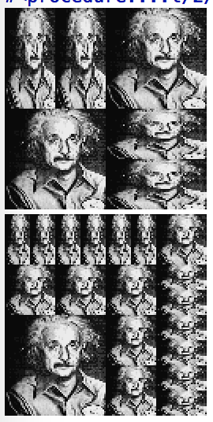
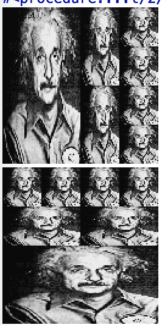

这两道题目是关于图形语言的，主要是展示数据抽象和闭包的威力，其中也以一种非常本质的方式使用了高阶过程。

在sicp一书的开始就强调了，在描述一门语言时，应该将注意力集中在语言的`基本原语`、它的`组合手段`以及它的`抽象方式`。

我在这里用了Racket来实现这些图形操作，这是它的[文档](http://planet.racket-lang.org/package-source/soegaard/sicp.plt/2/1/planet-docs/sicp-manual/index.html)。

我这里用了`einstein`这个基本的painter来实现各种操作。

用的时候也比较简单，加上下面两行就够了：
```
#lang racket 
(require ( planet "sicp.ss" ( "soegaard" "sicp.plt" 2 1)))
```
下面就可以写自己的过程了

##2.44

```
(define (right-split painter n)
  (if (= n 0)
      painter
      (let ((smaller (right-split painter (- n 1))))
        (beside painter (below smaller smaller)))))

(define (up-split painter n)
  (if (= n 0)
      painter
      (let ((smaller (up-split painter (- n 1))))
        (below painter (beside smaller smaller)))))

(define (corner-split painter n)
  (if (= n 0)
      painter
      (let ((up (up-split painter (- n 1)))
            (right (right-split painter (- n 1))))
        (let ((top-left (beside up up))
              (bottom-right (below right right))
              (corner (corner-split painter (- n 1))))
          (beside (below painter top-left)
                  (below bottom-right corner))))))

(paint (corner-split einstein 1))
(paint (corner-split einstein 2))
```



## 2.45

```
(define (split l r)
  (lambda (painter n)
    (if (= n 0)
      painter
      (let ((smaller ((split l r) painter (- n 1))))
        (l painter (r smaller smaller))))))

(define right-split2 (split beside below))
(define up-split2 (split below beside))

(paint (right-split2 einstein 2))
(paint (up-split2 einstein 2))
```



这里有一点值得注意，就是上面`let`中是如何递归调用没有名字的lambda函数的。