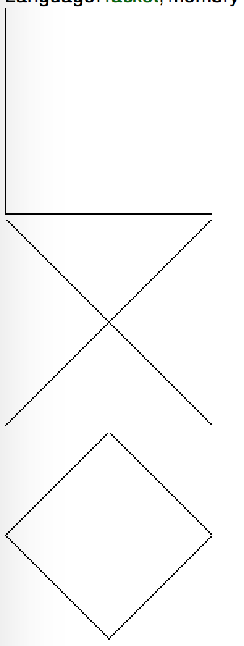
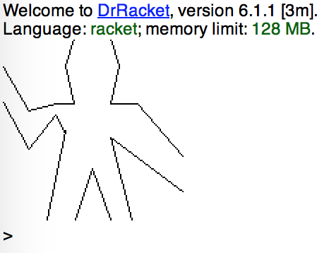
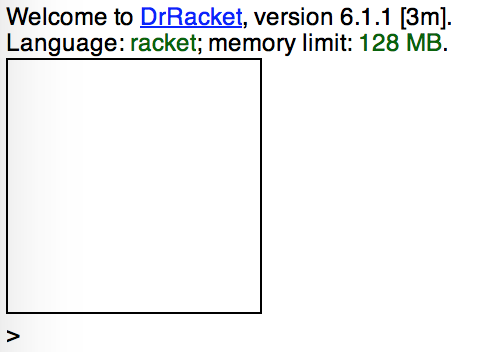
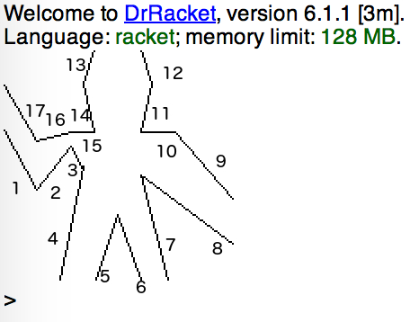

这里依然使用Racket语言实现，具体配置可以参考：[2.44_2.45.md](/exercises/02/2.44_2.45.md)。

`segments->painter`及其相关函数已经内置在`sicp.plt`中，我们只需要require即可。

我们只需要构造一系列segment来满足题目要求即可。

```
#lang racket
(require ( planet "sicp.ss" ( "soegaard" "sicp.plt" 2 1)))
; a)
(paint
  (segments->painter
    (list
      (make-segment (make-vect 0 0) (make-vect 0 1))
      (make-segment (make-vect 0 1) (make-vect 1 1))
      (make-segment (make-vect 1 1) (make-vect 1 0))
      (make-segment (make-vect 1 0) (make-vect 0 0)))))

; b)
(paint
  (segments->painter
    (list
      (make-segment (make-vect 0 0) (make-vect 1 1))
      (make-segment (make-vect 0 1) (make-vect 1 0)))))

; c)
(paint
  (segments->painter
    (list
      (make-segment (make-vect 0 0.5) (make-vect 0.5 0))
      (make-segment (make-vect 0.5 0) (make-vect 1 0.5))
      (make-segment (make-vect 1 0.5) (make-vect 0.5 1))
      (make-segment (make-vect 0.5 1) (make-vect 0 0.5)))))

; d)
(paint
  (segments->painter
    (list
      (make-segment (make-vect 0 0.65) (make-vect 0.14 0.39))
      (make-segment (make-vect 0.14 0.39) (make-vect 0.29 0.58))
      (make-segment (make-vect 0.29 0.58) (make-vect 0.34 0.49))
      (make-segment (make-vect 0.34 0.49) (make-vect 0.24 0))
      (make-segment (make-vect 0.4 0) (make-vect 0.49 0.28))
      (make-segment (make-vect 0.49 0.28) (make-vect 0.59 0))
      (make-segment (make-vect 0.71 0)  (make-vect 0.59 0.45))
      (make-segment (make-vect 0.59 0.45) (make-vect 0.99 0.15))
      (make-segment (make-vect 0.99 0.35) (make-vect 0.74 0.64))
      (make-segment (make-vect 0.74 0.64) (make-vect 0.59 0.64))
      (make-segment (make-vect 0.74 0.64) (make-vect 0.59 0.64))
      (make-segment (make-vect 0.59 0.64) (make-vect 0.64 0.85))
      (make-segment (make-vect 0.64 0.85) (make-vect 0.59 1))
      (make-segment (make-vect 0.39 1) (make-vect 0.34 0.85))
      (make-segment (make-vect 0.34 0.85) (make-vect 0.39 0.64))
      (make-segment (make-vect 0.39 0.64) (make-vect 0.29 0.64))
      (make-segment (make-vect 0.29 0.64) (make-vect 0.14 0.6))
      (make-segment  (make-vect 0.14 0.6) (make-vect 0 0.84)))))
```
结果依次是：





可以看到，第一个图右部与上部没有显示出来，我们可以给0.99。这样就能够显示出来了。

```
(paint
  (segments->painter
    (list
      (make-segment (make-vect 0 0) (make-vect 0 0.99))
      (make-segment (make-vect 0 0.99) (make-vect 0.99 0.99))
      (make-segment (make-vect 0.99 0.99) (make-vect 0.99 0))
      (make-segment (make-vect 0.99 0) (make-vect 0 0)))))
```




<del>这里我没画wave，其实也不难，需要大致算一下大致的坐标，后面有机会再补上。</del>

抽了大概一个小时，把wave给画出来了，下面这个图展示了画的顺序：




将画家表示为过程，为这一图形语言建立起了一道强有力的抽象屏障。使我们可以创建和混用基于各种图形能力的各种类型的基本画家。
任何过程只要能取一个框架作为参数，画出某些可以伸缩后适合这个框架的东西，它就可以作为一个画家。
再一次模糊了数据与过程的关系。