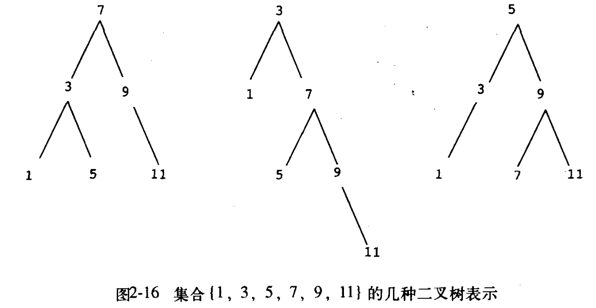

```
(load "lib/tree.scm")
(define (tree->list-1 tree)
  (if (null? tree) 
    '()
    (append
      (tree->list-1 (left-branch tree))
      (cons (entry tree)
            (tree->list-1 (right-branch tree))))))

(define (tree->list-2 tree)
  (define (copy-to-list tree result)
    (if (null? tree)
      result
      (copy-to-list (left-branch tree)
                    (cons (entry tree)
                          (copy-to-list (right-branch tree)
                                        result)))))
  (copy-to-list tree '()))
```

这里先简单分析下这两个转换：

  - `tree->list-1`比较明显，相当于前序遍历，即依次访问了左子树--->根节点--->右子树
  - `tree->list-2`就没那么明显了，注意看`copy-to-list`是如何递归的，这里是双重递归，即递归调用时的第二个参数，也是递归。所以我们这里要从这第二个参数开始看起，这就不难发现它是按照：右子树--->根节点--->左子树的顺序访问的，但是由于它用了`cons`连接符，相当于把后访问的，放到了前面，所以它与`tree->list-1`的结果是一样的

图2.16中的树表示如下：



```
(define tree1
  (make-tree 7 
             (make-tree 3 
                        (make-tree 1 '() '()) 
                        (make-tree 5 '() '()))
             (make-tree 9 
                        '()
                        (make-tree 11 '() '()))))
(tree->list-1 tree1)
;Value: (1 3 5 7 9 11)
(tree->list-2 tree1)
;Value: (1 3 5 7 9 11)
(define tree2
  (make-tree 3 
             (make-tree 1 '() '())
             (make-tree 7 
                        (make-tree 5 '() '())
                        (make-tree 9 
                                   '() 
                                   (make-tree 11 '() '())))))
(tree->list-1 tree2)
;Value: (1 3 5 7 9 11)
(tree->list-2 tree2)
;Value: (1 3 5 7 9 11)
```  

问题 b：

  将n个节点的平衡树变换为表时，两个转换过程所需的步数是否具有相同量级的增长速度？

`tree->list-1`是树形递归，`tree->list-2`也是树形递归，它们都需要访问每个节点一次，所以说它们的时间复杂度是一样的。但是由于`tree->list-1`中用了append过程，append过程本身是`O(n)`，所以`tree->list-1`的时间要长一些。

用数学表达式来表示就是：

对于`tree->list-1`来说有: 
  
  T(n) = 2*T(n/2) + O(n/2) (append是线性的)

通过[主定理](https://zh.wikipedia.org/zh/%E4%B8%BB%E5%AE%9A%E7%90%86)解上的等式可以得到：

  T(n) = O(n * log n)

对于`tree->list-2`有:

  T(n) = 2*T(n/2) + O(1)

解上的等式可以得到：

  T(n) = O(n)
