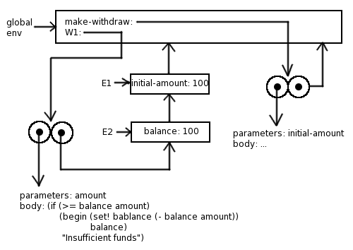
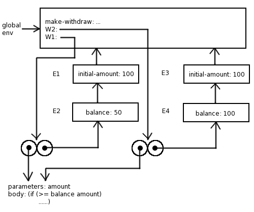

```
(define (make-account initial-amount)
  (let ((balance initial-amount))
    (lambda (amount)
      (if (> balance amount)
        (begin (set! balance (- balance amount))
               balance)
        "Insufficient funds"))))
```

上面这个过程，多了一个`let`，`let`其实就是匿名函数调用的语法糖衣，在创建这个匿名过程时，会创建一个新环境E1，紧接着执行`let`里面的`lambda`表达式，它又会创建一个匿名过程，所以就又会创建个新环境，称为E2，并且指向E1。



当创建`W2`时，如下



图片截取自：

- https://wqzhang.wordpress.com/2009/07/13/sicp-exercise-3-10/

其实这里只要把过程的环境是在过程创建时生产的搞清楚就可以了，一般很容易误解时在`运行时`创建的环境，其实这是不对的。

大家先去想这个环境间的关系时，只需要明确下面两点，任何问题就都能轻松解决了：

1. 环境是在过程声明时创建，在运行时使用，仅此而已。环境的指向就是声明过程时的那个环境。
2. 匿名函数的调用是把环境的声明和使用放到一起去了。

我用 Java 使用了个 Scheme 的方言，其中关于环境创建一开始也没想好怎么处理，后来明白了上面两个就很简单了。具体实现可以参考[SFunction.java](https://github.com/jiacai2050/JCScheme/blob/master/src/main/java/net/liujiacai/jcscheme/type/SFunction.java)的`apply`方法。重点参考环境的指向是怎么形成的。