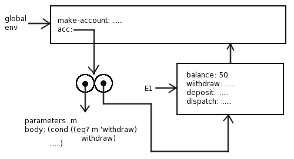
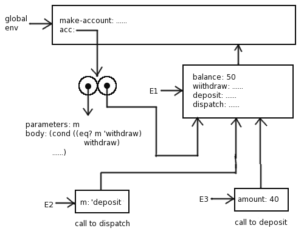
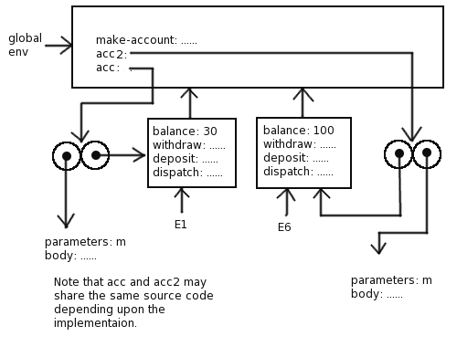

道理和习题3.10一样，比较重要，这里再说一遍：

1. 环境是在过程声明时创建，在运行时使用，仅此而已。环境的指向就是声明过程时的那个环境。
2. 匿名函数的调用是把环境的声明和使用放到一起去了。

为了方面大家理解，我还是从别人那里截取了几张图供大家参考

图片来源：

- https://wqzhang.wordpress.com/2009/07/14/sicp-exercise-3-11/ 