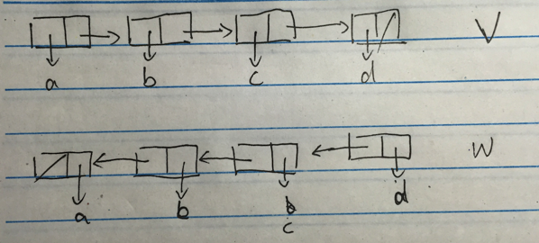

```
(define (mystery x)
  (define (loop x y)
    (if (null? x)
      y
      (let ((temp (cdr x)))
        (set-cdr! x y)
        (loop temp x))))
  (loop x '()))
```



这个`mystery`还真的挺神奇的，这个需要拿支笔在纸上好好画画就能明白是怎么工作的了。

这里想到了一个问题，空表`()`的盒子指针是什么样的，因为我们`(cons 'a '())`得到的盒子指针我们是比较好理解的。

后来[wiki cons](https://en.wikipedia.org/wiki/Cons)上找到了答案，`()`并没有什么盒子指针，它就是字面量`NIL`，是一特殊元素，大家可以联想计算机里面是如何表示空的，大部分编程语言都是用`null`，那么`null`是什么东西呢，其实就是人为规定的一符号，仅此而已。

其实计算机如何表示“空”的概念很tricky，[The worst mistake of computer science](https://www.lucidchart.com/techblog/2015/08/31/the-worst-mistake-of-computer-science/) 这篇文章说了这么一句：

> NULL is a value that is not a value. And that’s a problem.

最后有一句点睛之笔：

>  just as Sauron is a mere servent of Morgoth, so too is NULL a mere manifestation of the underlying problem of sentinels.

`Sauron`与`Morgoth`应该是神话中的两个人物我们可以先不管，最后那句意思是：

> NULL 只不过是底层问题的表现形式，仅此而已。

建议大家都去看看那篇英文文章。