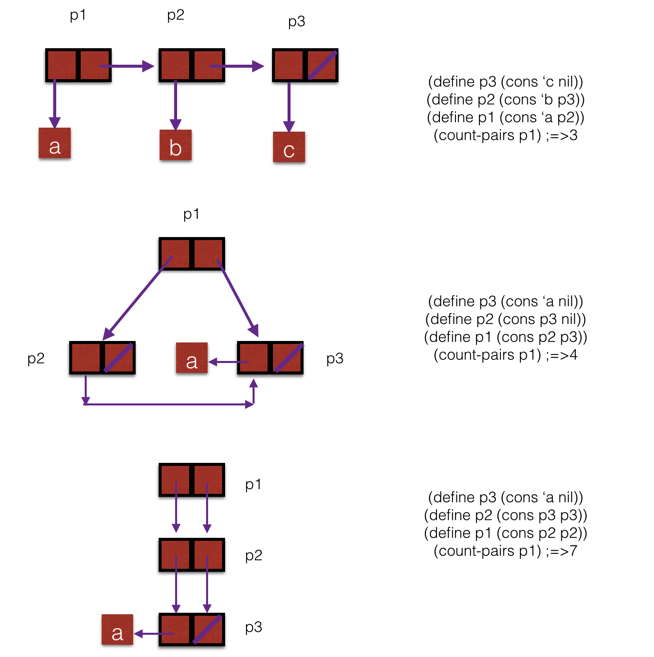
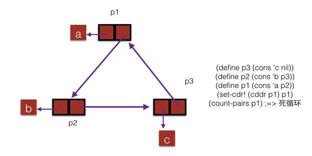

做了这题后才真正意识到盒模型的威力，之前没有`set!`之类的操作时，序对产生的结构能想到的也就是表，而且是没有循环结构的表， 现在允许修改序对的结构后，瞬间威力大增了。

需要注意的是，我上面是一步步用`cons`构造起来的表，而不是直接用字面量表示的。

比如第二个例子不能直接写`'(((a)) a))`，因为这样前后`a`所在的表不是同一个表了，这点一定要注意，坑了我一下午。😭

下面再给个完整的代码：
```
(define nil '())
(define (count-pairs x)
  (if (not (pair? x))
    0
    (+ (count-pairs (car x))
       (count-pairs (cdr x))
       1)))

(define p3 (cons 'c nil))
(define p2 (cons 'b p3))
(define p1 (cons 'a p2))
(count-pairs p1)
;Value: 3

(define p3 (cons 'a nil))
(define p2 (cons p3 nil))
(define p1 (cons p2 p3))
(count-pairs p1)
;Value: 4

(define p3 (cons 'a nil))
(define p2 (cons p3 p3))
(define p1 (cons p2 p2))
(count-pairs p1)
;Value: 7

(define p3 (cons 'c nil))
(define p2 (cons 'b p3))
(define p1 (cons 'a p2))
(set-cdr! (cddr p1) p1)
(count-pairs p1)
;Aborting!: maximum recursion depth exceeded
```