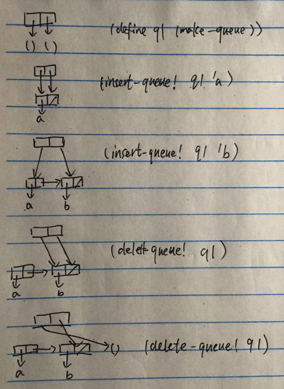

这里主要是还是看盒模型，明确头指针与尾指针的指向，然后就是清楚 Scheme 里面是怎么打印 list 的。

```
(define (print-queue queue)
  (define (iter l)
    (if (null? l)
      '()
      (cons (car l) (iter (cdr l)))))
  (iter (front-ptr queue)))

(define q1 (make-queue))
(insert-queue! q1 'a)
(insert-queue! q1 'b)
(print-queue q1)
; (a b)
(delete-queue! q1)
(print-queue q1)
; (b)
(delete-queue! q1)
(print-queue q1)
; ()
```