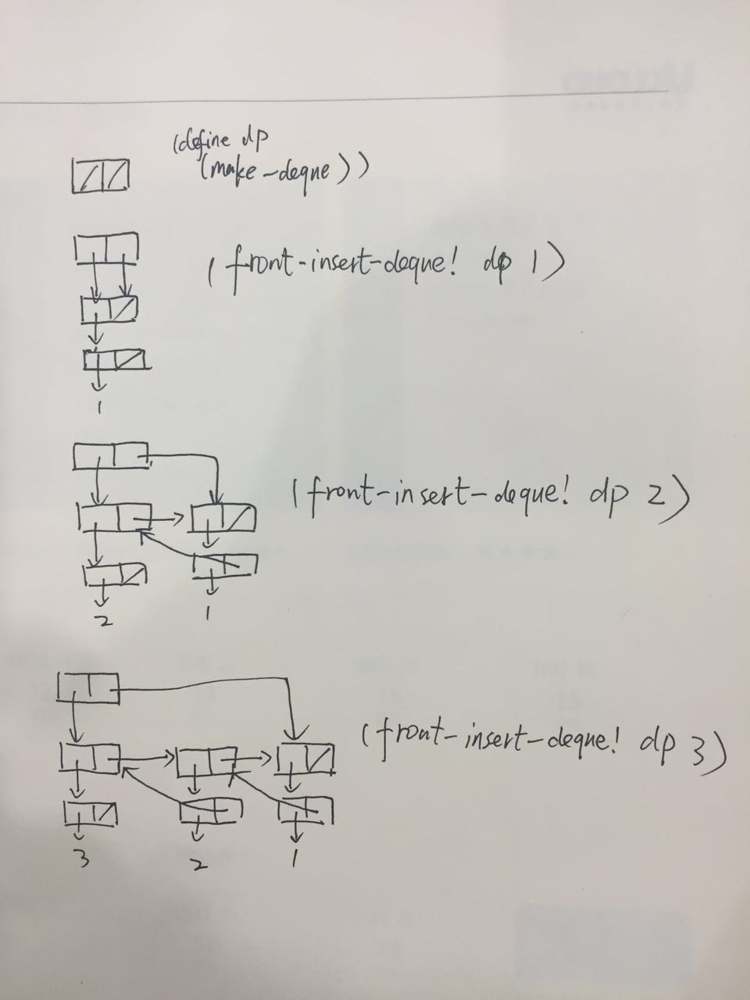

上图是我`双向链表`的序对表示，后面讲解二维表时也用到了这种技巧，上排的序对叫作`gluing pairs`（胶水序对），是链表的骨架（backbone），下面那一排序列才是真正存放数据的序对。
```
; A deque (double-ended queue) as defined by the following set of items:
; A constructor: (make-deque)
; A predicate: (empty-deque? <deque>) 
; Two selectors (front-deque <deque>) (rear-deque <deque>)
; Four mutators:  (front-insert-deque! <deque> <item>)  (front-delete-deque! <deque>)
;                 (rear-insert-deque! <deque> <item>)  (rear-delete-deque! <deque>)


; inner helper operations
(define (set-front-ptr! deque p)
  (set-car! deque p))
(define (set-rear-ptr! deque p)
  (set-cdr! deque p))

(define (make-deque) (cons '() '()))
(define (front-ptr deque) (car deque))
(define (rear-ptr deque) (cdr deque))

(define (empty-deque? deque)
  (or (eq? (front-ptr deque) '())
      (eq? (rear-ptr deque) '())))
(define (front-deque deque)
  (front-ptr deque))
(define (rear-deque deque)
  (rear-ptr deque))
(define (front-insert-deque! deque item)
  (let ((data-pair (cons item '())))  
    (if (empty-deque? deque)
      (let ((ptr-pair (cons data-pair '())))
        (set-front-ptr! deque ptr-pair)
        (set-rear-ptr! deque ptr-pair)
        deque)
      (let ((first-data-pair (car (front-deque deque)))
            (ptr-pair (cons data-pair (front-deque deque))))
        (set-cdr! first-data-pair ptr-pair)
        (set-front-ptr! deque ptr-pair)
        deque))))
(define (rear-insert-deque! deque item)
  (let ((data-pair (cons item '())))
    (if (empty-deque? deque)
      (let ((ptr-pair (cons data-pair '())))
        (set-front-ptr! deque ptr-pair)
        (set-rear-ptr! deque ptr-pair)
        deque)
      (let ((ptr-pair (cons data-pair '())))
        (set-cdr! data-pair (rear-ptr deque))
        (set-rear-ptr! deque ptr-pair)
        deque))))

(define (front-delete-deque! deque)
  (if (empty-deque? deque)
    (error "DELETE on empty deque")
    (let ((first-ptr (front-deque deque)))
      (let ((second-ptr (cdr first-ptr)))
        (if (null? second-ptr)
          (begin
            (set-front-ptr! deque '())
            deque)
          (begin
            (set-cdr! (car second-ptr) '())
            (set-front-ptr! deque second-ptr)
            deque))))))

(define (rear-delete-deque! deque)
  (if (empty-deque? deque)
    (error "DELETE on empty deque")
    (let ((last-ptr (rear-deque deque)))
      (let ((second-ptr (car last-ptr)))
        (if (null? second-ptr)
          (begin
            (set-rear-ptr! deque '())
            deque)
          (begin
            (set-cdr! (cdr second-ptr) '())
            (set-rear-ptr! deque second-ptr)
            deque))))))

(define (print-deque deque)
  (define (iter l)
    (if (null? l)
      '()
      (cons (caar l) (iter (cdr l)))))
  (iter (front-ptr deque)))

(define dq (make-deque))
(front-insert-deque! dq 1)
(front-insert-deque! dq 2)
(front-insert-deque! dq 3)
(print-deque dq)
;Value: (3 2 1)
(front-delete-deque! dq)
(print-deque dq)
;Value: (2 1)
(rear-delete-deque! dq)
(print-deque dq)
;Value: (2)
```