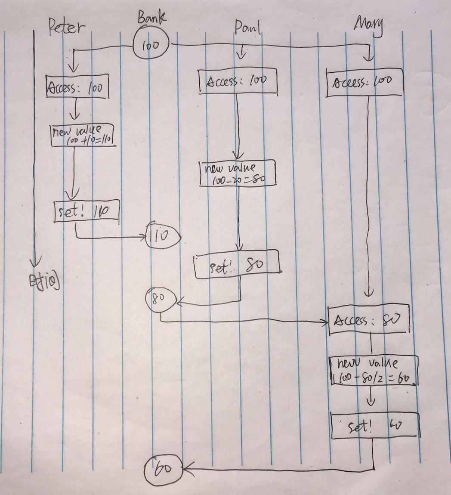

```
; Peter
(set! balance (+ balance 10))
; Paul
(set! balance (- balance 20))
; Mary
(set! balance (- balance (/ balance 2)))
```

## a)
如果上面三个过程按某顺序执行，无非有 6 种可能，即
1. `Peter --> Paul --> Mary`，这时 balance 的变化为`100 --> 110 --> 90 --> 45`
2. `Peter --> Mary --> Paul`，这时 balance 的变化为`100 --> 110 --> 55 --> 35`
3. `Paul --> Peter --> Mary`，这时 balance 的变化为`100 --> 80 --> 90 --> 45`
4. `Paul --> Mary --> Peter`，这时 balance 的变化为`100 --> 80 --> 40 --> 50`
5. `Mary --> Peter --> Paul`，这时 balance 的变化为`100 --> 50 --> 60 --> 40`
6. `Mary --> Paul --> Peter`，这时 balance 的变化为`100 --> 50 --> 30 --> 40`

综上所述，balance 最终的结果共四种，分别为：35，40，45，50。

## b)
如果允许上面三个进程交错进行，那么情况就复杂多了。

下面仅举一种情况（最终 balance 为 60）：

