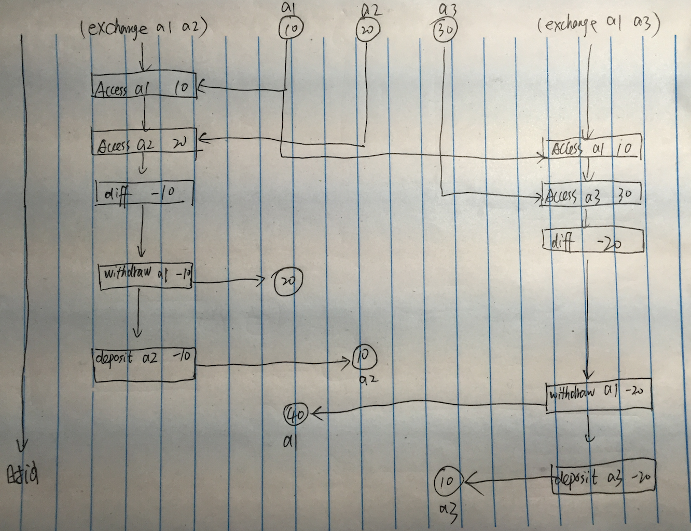

```
; 第一个版本的交换程序 
(define (exchange account1 account2)
  (let (difference (- (account1 'balance)
                      (account2 'balance)))
    ((account1 'withdraw) difference)
    ((account2 'deposit) difference)))
```
书中为了简化，允许`deposit`一个负值。

本题问的比较多，我们一个个来回答。

## a) 

> 请论证，如果三个`exchange`进程顺序运行，那么经过任何次并发交换，这些账户的余额将还是按某顺序排列的10、20和30。

这个比较简单，因为三个`exchange`按照顺序运行，所以就不会出现一个进程访问 balance 时，另一个进程修改 balance 的情况，更不会出现同时写的情况。

## b)

> 请画出类似于图 3-29 中那样的时间图，说明如果采用第一个版本的交换程序，那么 `a)` 中的结论就不成立。 



可以看到，最终的余额依次为40、10和10。

## c)

> 论证，即使采用第一个版本的交换程序，这些账户里的余额之和也将保持不变。

这是因为，虽然`exchange`仍然是并行的，但是单个账户内的`withdraw`与`deposit`仍然是顺序运行的，也就是说不会出现一个账户内`withdraw`与`deposit`不一致的情况（这里的一致是指，原账户金额减去所有`withdraw`的金额，加上所有`deposit`的金额即为该账户最终的金额），所以三个账户加起来总和不变。

## d)

> 画出一个时序图，说明如果我们不做各个账户上交易的串行化，那么三个账户的总和就会改变，也即 `c)` 不成立。

其实这个就更简单了，因为单个账户内都可能不会`withdraw`与`deposit`不一致的情况，那么三个账户的总和很有可能就不一致了。

这里偷个懒，图就不画了。后面心情好再来填坑。 TODO