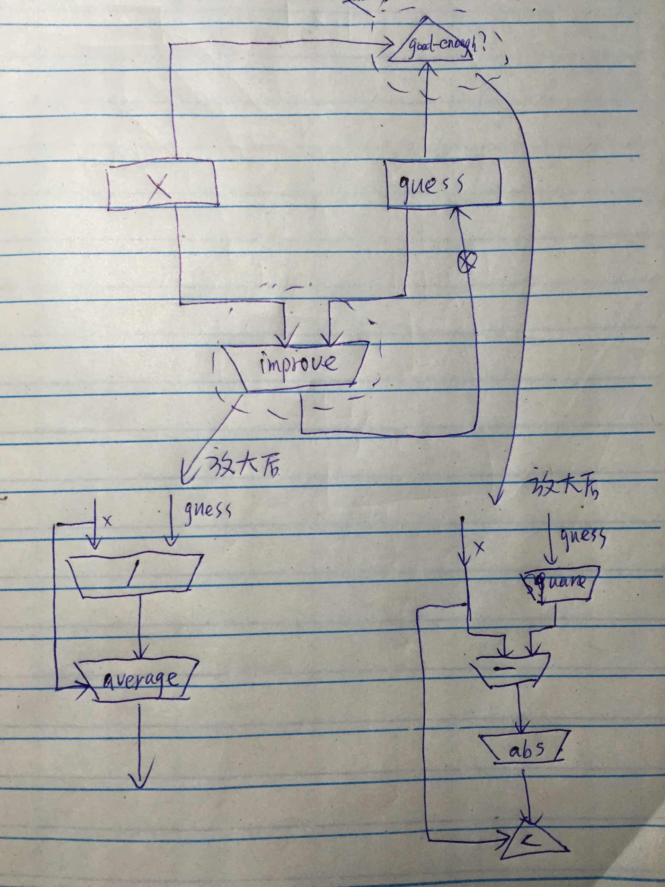

- 假设 good-enough? improve 为可用的基本操作
```
(controller
  (assign x (op read))
  (assign guess (const 1.0))

  test-good
    (test (op good-enough?) (reg guess) (reg x))
    (branch (label done))
    (assign t (op improve) (reg guess) (reg x))
    (assign guess (reg t))
    (goto test-good)
  done

  (perform (op print) (reg guess)))
```

- 展开后的sqrt
```
(controller
  (assign x (op read))
  (assign guess (const 1.0))

  good-enough?
    (assign tmp1 (op *) (reg guess) (reg guess))
    (assign tmp1 (op -) (reg tmp1) (reg x))
    (assign tmp1 (op abs) (reg tmp1))
    (test (op <) (reg tmp1) (const 0.001))
    (branch iter-done)
    ; improve
    (assign tmp2 (op /) (reg x) (reg guess))
    (assign tmp2 (op average) (reg guess) (reg tmp2))
    (assign guess (reg tmp2))
    (goto good-enough?)
  iter-done
    (perform (op print) (reg guess)))

```
